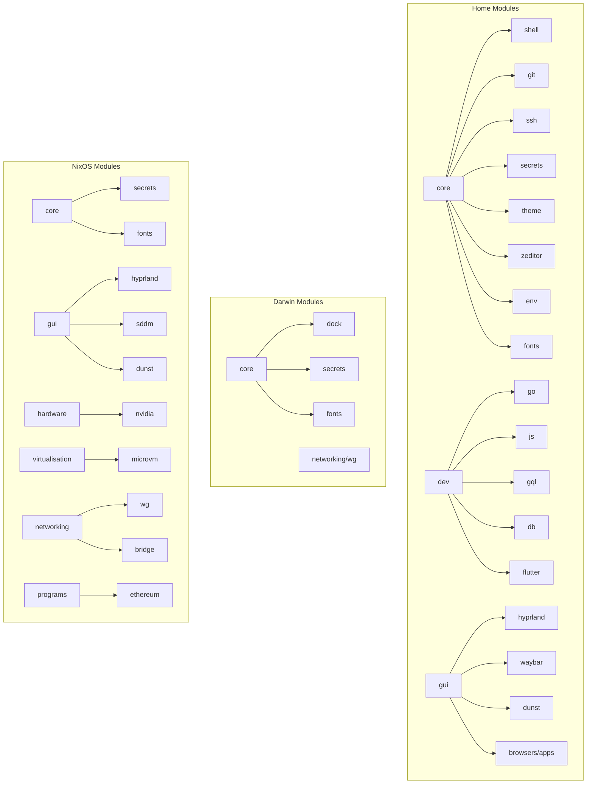

# Fellowship Architecture

> [!note] Gitian Docs
> This repository uses [Gitian](https://www.gitian.dev/docs) for code documentation.
> Source files are annotated with `@gitian` tags — browse them in the Gitian viewer
> for rendered annotation cards, wikilinks, and syntax-highlighted code blocks.

## Framework

Fellowship uses **Snowfall Library** to organize a multi-platform NixOS/nix-darwin flake.
Snowfall auto-discovers modules, packages, systems, and homes by directory convention:

```
modules/<scope>/<category>/<name>/default.nix
packages/<name>/default.nix
systems/<arch>/<hostname>/default.nix
homes/<arch>/<username>/default.nix
lib/<name>/default.nix
```

The namespace `fellowship` is injected into every module as a function argument,
used for option paths like `config.fellowship.home.dev.enable`.

## Systems

| Host | Arch | OS | User | Role |
|------|------|----|------|------|
| **baradur** | x86_64-linux | NixOS | arrayofone | Desktop workstation |
| **helms-deep** | aarch64-linux | NixOS | - | MicroVM host (RPi5/arm) |
| **digibook** | aarch64-darwin | macOS | db | Work dev laptop |
| **dbook** | aarch64-darwin | macOS | db | Minimal darwin config |
| **mingabook** | aarch64-darwin | macOS | darrenbangsund | Primary dev machine |

## Module Tree



## Key Patterns

- **Option gating**: Modules use `lib.mkEnableOption` + `lib.mkIf` so features are opt-in per host
- **Namespace helpers**: [[default.nix|lib/module]] provides `mkOpt`, `mkBoolOpt`, `enabled`/`disabled`
- **Identity splitting**: Git and SSH use path-based (`gitdir:`) and host-alias (`gitwork:`) switching
- **Runtime secrets**: Environment variables are injected via shell init, not `sessionVariables`, to avoid Nix store leakage. See [[secrets]].
- **Theming**: Stylix applies Catppuccin Macchiato globally; Zed uses its own Palenight theme

## Flake Inputs

See [[flake.nix]] for the full input map. Key groups:

- **Core**: nixpkgs, snowfall-lib, home-manager, sops-nix, stylix
- **NixOS-only**: hyprland, microvm, ethereum-nix
- **Darwin-only**: nix-darwin, nix-rosetta-builder, nix-homebrew, homebrew taps
