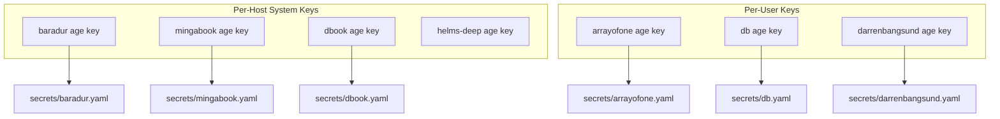

# Secrets Management

> [!danger] Security
> Never commit decrypted secrets. Always use `task secrets:edit:*` or `sops` directly.
> The `.sops.yaml` at the repo root controls which age keys can decrypt each file.

## Overview

Fellowship uses **SOPS** with **age** encryption for managing secrets across all hosts.
Secrets are encrypted at rest in `secrets/*.yaml` and decrypted at system activation
by `sops-nix`.

## Key Hierarchy



## Secret Scopes

| File | Scope | Decrypted by | Contents |
|------|-------|-------------|----------|
| `secrets/<hostname>.yaml` | System | Host SSH/age key | VPN keys, system passwords |
| `secrets/<username>.yaml` | User | User age key | Git credentials, API keys |

## Three Secrets Modules

Secrets are consumed by three independent sops-nix modules:

1. **[[secrets.nix|modules/home/core/secrets.nix]]** — Home-manager scope.
   Decrypts user secrets (git creds, API keys) using `~/.ssh/sops-nix`.

2. **[[secrets.nix|modules/darwin/core/secrets.nix]]** — Darwin system scope.
   Decrypts host secrets (VPN keys) using `/etc/ssh/ssh_host_ed25519_key`.

3. **[[secrets.nix|modules/nixos/core/secrets.nix]]** — NixOS system scope.
   Decrypts host secrets (user passwords, VPN keys) using the host SSH key.

## Runtime Injection

> [!warning] Store Leakage
> Never use `home.sessionVariables` for secrets — values get embedded in the Nix store
> (world-readable). Instead, secrets are read at shell init time from sops-nix paths.

The [[env.nix|modules/home/core/env.nix]] module injects API keys at runtime:

```nix
programs.zsh.initContent = ''
  if [ -f "${config.sops.secrets."ai/anthropic/api-key".path}" ]; then
    export ANTHROPIC_API_KEY=$(cat "${config.sops.secrets."ai/anthropic/api-key".path}")
  fi
'';
```

## Task Commands

| Command | Action |
|---------|--------|
| `task secrets:init` | Generate keys and bootstrap encrypted files |
| `task secrets:edit:system` | Edit host secrets (`secrets/<hostname>.yaml`) |
| `task secrets:edit:user` | Edit user secrets (`secrets/<username>.yaml`) |
| `task secrets:encrypt:system` | Re-encrypt host secrets after `.sops.yaml` changes |
| `task secrets:decrypt:system` | Decrypt host secrets in-place (for inspection) |

## Adding a New Secret

1. Add the secret path to the relevant sops-nix module (`sops.secrets."path/to/secret" = {};`)
2. Run `task secrets:edit:user` (or `:system`) to add the value
3. Reference it in your config as `config.sops.secrets."path/to/secret".path`
